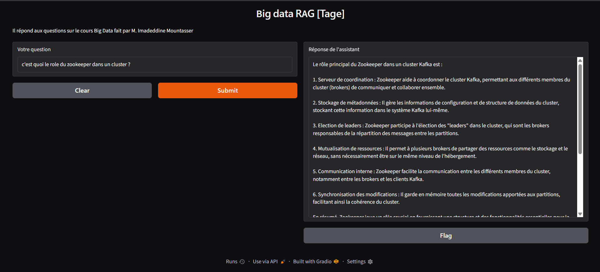

# Big Data RAG

A specialized **Retrieval-Augmented Generation (RAG)** system for exploring Big Data engineering courses, practical workshops, and assignments. The project combines document extraction, OCR, multilingual semantic search, and an open-source Qwen language model to answer questions using a personal knowledge base of PDF documents.



> **TestOfRAG** is the deployed interface used to query the indexed Big Data learning materials.

## Overview

This project demonstrates how to build an end-to-end RAG pipeline in Google Colab:

1. Load PDF course materials from Google Drive.
2. Extract text with `pypdf`.
3. Apply OCR with Tesseract when a PDF contains little or no extractable text.
4. Split the extracted content into overlapping passages.
5. Convert each passage into a multilingual embedding.
6. Retrieve the passages most relevant to a user question.
7. Use the Qwen instruction-tuned model to generate an answer grounded in the retrieved context.
8. Expose the system through an interactive Gradio interface.

The knowledge base includes materials related to Apache Kafka, Apache Hadoop, Docker, Mega Data courses, and practical assignments.

## Project architecture

```text
PDF files in Google Drive
          │
          ▼
Text extraction with pypdf
          │
          ├── Text available ───────────────┐
          │                                  │
          └── Scanned PDF → Tesseract OCR ───┘
                                             ▼
                              Cleaning and chunking
                                             ▼
                       Multilingual sentence embeddings
                                             ▼
                            Similarity-based retrieval
                                             ▼
                         Qwen2.5-1.5B-Instruct model
                                             ▼
                              Answer through Gradio
```

## Main technologies

- **Python** and **Jupyter Notebook**
- **Google Colab** for execution
- **Qwen/Qwen2.5-1.5B-Instruct** for answer generation
- **Sentence Transformers** with `paraphrase-multilingual-MiniLM-L12-v2` for embeddings
- **PyPDF** for PDF text extraction
- **Tesseract OCR** and `pytesseract` for scanned documents
- **pdf2image** and Poppler for converting PDF pages to images
- **NumPy** for vector similarity search
- **Gradio** for the interactive RAG application
- **Google Drive** for document storage

## Dataset and document processing

The notebook reads PDF files recursively from the following Google Drive directory:

```text
/content/drive/MyDrive/Eidia 4/Méga-données/test
```

For each PDF, the pipeline first attempts standard text extraction. If fewer than 200 characters are extracted, the document is treated as scanned and processed with OCR using French and English language models:

```python
pytesseract.image_to_string(img, lang="fra+eng")
```

The extracted text is normalized and divided into passages of approximately 1,000 characters with an 80-character overlap. This overlap helps preserve context between neighboring passages.

## Retrieval process

Each passage is encoded together with its document title using:

```python
sentence-transformers/paraphrase-multilingual-MiniLM-L12-v2
```

Embeddings are normalized and compared with the question embedding using a dot product, which is equivalent to cosine similarity for normalized vectors. The most relevant passages are then provided to the generation model as context.

The notebook successfully demonstrates indexing **553 passages**, with each passage represented by a 384-dimensional vector.

## Language model

The generation component uses the open-source model:

```python
Qwen/Qwen2.5-1.5B-Instruct
```

The model is loaded with the Hugging Face Transformers pipeline and configured to use the available GPU in Google Colab when possible.

## Installation

Run the notebook in Google Colab or another Python environment with a compatible GPU:

```bash
pip install -q sentence-transformers gradio pypdf
pip install gdown torch pdfplumber
pip install -q pytesseract pdf2image pypdf
apt-get install -y tesseract-ocr tesseract-ocr-fra poppler-utils
```

The complete implementation is available in [`Big_data_courses_RAG.ipynb`](./Big_data_courses_RAG.ipynb).

## How to run

1. Open [`Big_data_courses_RAG.ipynb`](./Big_data_courses_RAG.ipynb) in Google Colab.
2. Connect a runtime with sufficient RAM and, preferably, a GPU.
3. Mount Google Drive when prompted.
4. Place the source PDF files in the configured Google Drive directory.
5. Run the installation, model-loading, extraction, chunking, and embedding cells in order.
6. Launch the Gradio interface.
7. Ask questions about the indexed Big Data courses and practical work.

If your documents are stored in another location, update `DRIVE_FOLDER_PATH` in the notebook before running the extraction cell.

## Example questions

- What is Apache Kafka?
- How do I install Hadoop on a local machine?
- What is the difference between Kafka Cloud and Kafka Local?
- How can I configure a distributed Hadoop environment?
- What are the main steps in the Docker practical assignment?

## Important notes

- The notebook is designed for **Google Colab** and expects Google Drive integration.
- OCR processing can take considerably longer than normal PDF text extraction.
- A GPU is recommended for faster model loading and text generation.
- The system answers from the indexed documents; it may not know information that is absent from the knowledge base.
- The source documents are not included in this repository and must be provided separately through Google Drive.
- Before publishing or sharing the application, review the source PDFs and remove any private or sensitive information.

## Repository contents

| File | Description |
|---|---|
| [`Big_data_courses_RAG.ipynb`](./Big_data_courses_RAG.ipynb) | Complete notebook implementing document ingestion, OCR, embeddings, retrieval, and generation |
| [`TestOfRAG.png`](./TestOfRAG.png) | Screenshot of the deployed RAG interface |
| [`README.md`](./README.md) | Project documentation |

## Author

| | |
|:--:|:--|
|  | **Yassir Tagemouati** <br><br> Big Data Engineering Student (Cycle d’Ingénieur) <br> Azure Data Engineering • Data Warehousing • Analytics <br><br> **GitHub:** [@TageYassir](https://github.com/TageYassir) |

## License

No license has been specified for this repository yet. Add a license file if you plan to allow reuse or redistribution of the code or documentation.
